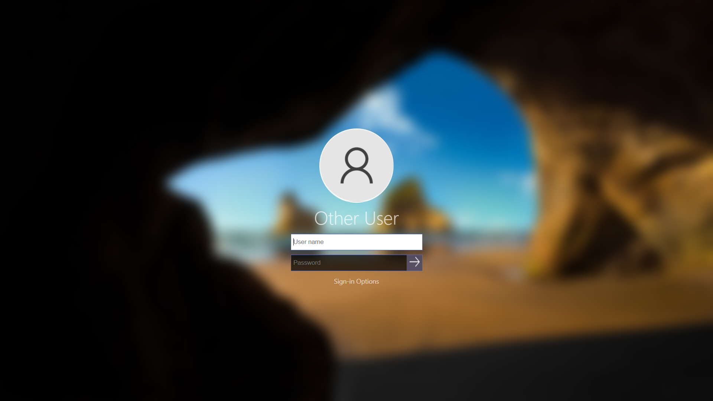
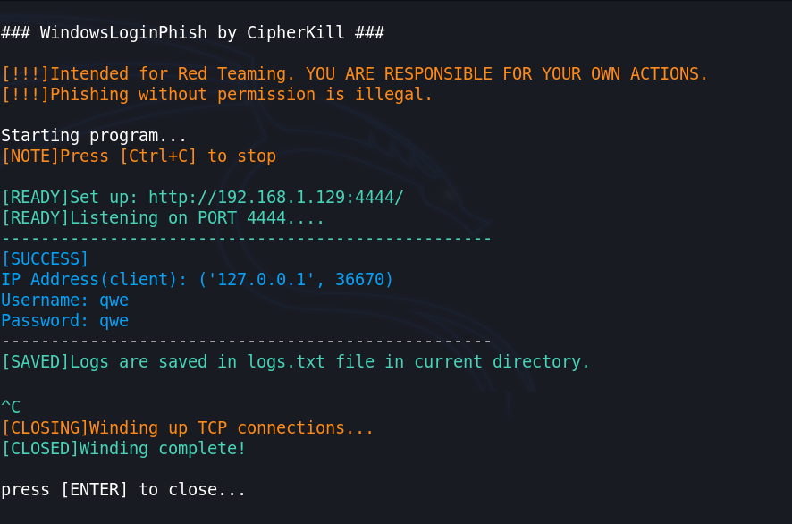

# Windows Login Phishing page
This is a phishing page for windows login screen. That's it.
## Use this link to preview without downloading/cloning. 
https://htmlpreview.github.io/?https://github.com/CipherKill/windows-login-phish/blob/main/docs/preview/index.html

## Issues/Bugs:
- Mysterious duplicate GET request.
- Make force fullscreen (UNLIKELY FIX but will look into).

# How to use ?
Within the directory there are 2 files by the name of:
  - AttackersSetup(windows).exe
  - AttackerSetup4linux (see images below)  
  
As per your OS, either **Windows or Linux**, execute the appropriate AttackerSetup program, that's it.
Note: *Tested and works on on both windows and linux platform.*

#### Scenario would be like...
- Run the **setup** and the program will **automatically** host the required files.
- Once the program shows the active URL and `[READY!]`, then secretly go to the victim's computer when he is distracted.
- Open **victim's browser** and put in the **URL(shown in the setup)** and use **F11 for fullscreen**. Viola! Now the lockscreen page will appear.
- Go back to your setup program and just wait for the victim to put in his credentials. When he does, the username and password will be displayed in the console. 
- Note: *logs.txt file is created with the data saved from console.*  

## Screenshots
### Victim Screen

</img>
</img>

### Attacker Screen

#### AttackerSetup Program outputs
</img>

#### Running the setup(linux)-[to make it executable file]
</img>

(OR)

</img>
 - For windows, you can directly run the .exe file

# What it is made and used with so far?
- HTML  (for webpage)
- CSS (for styles)
- JS  (for functionality)
- Python (for UI)

